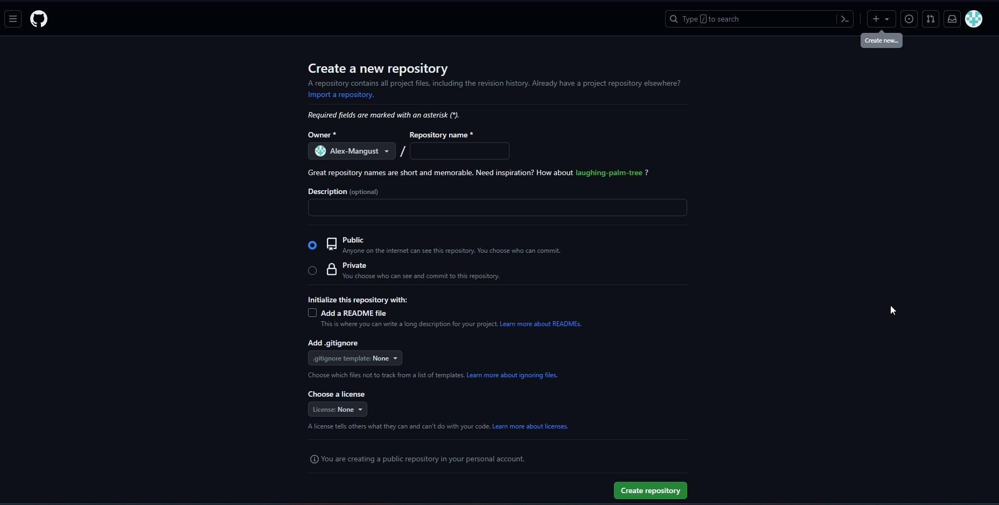
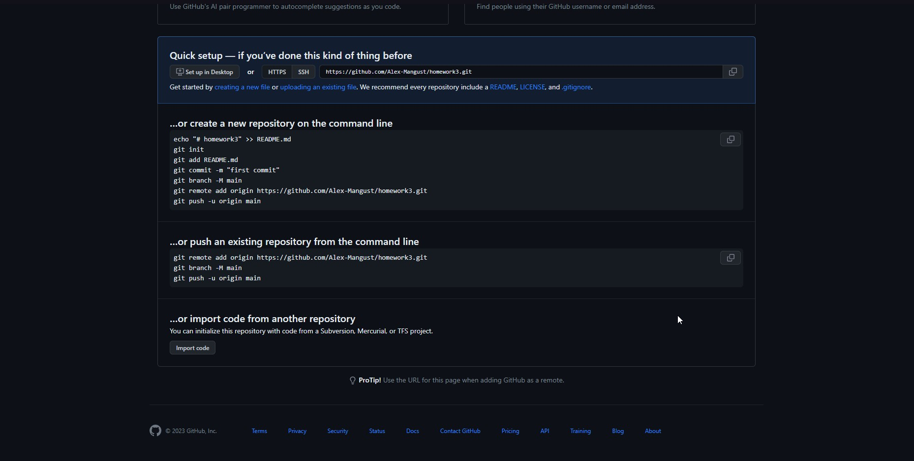
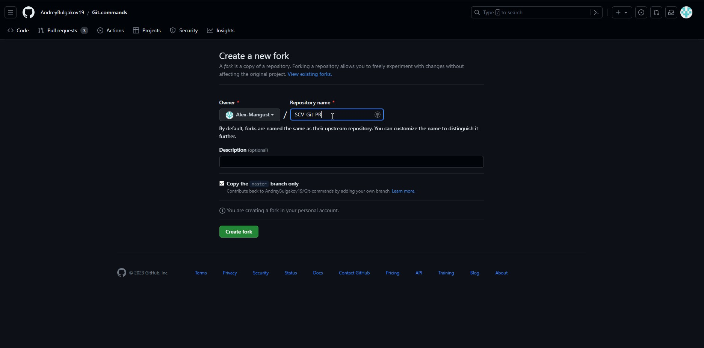
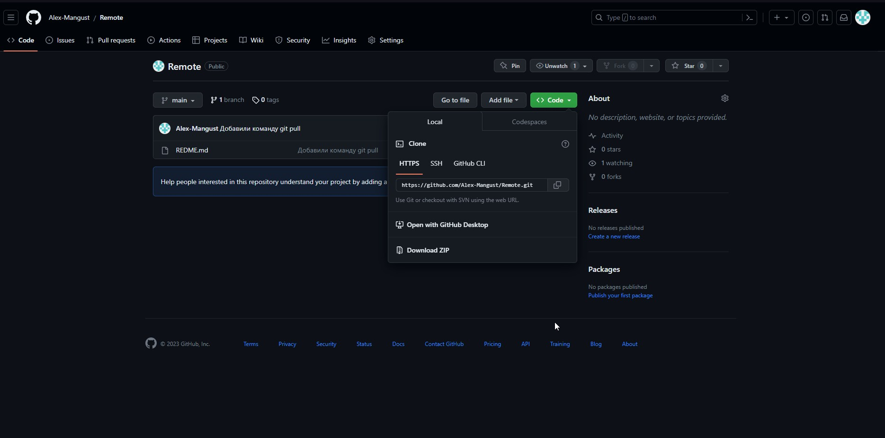
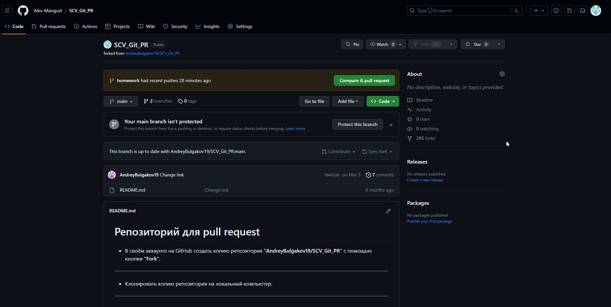

# Работа с Git и GitHub
##### (Инструкция по работе с Git в VSCode)
## 1. Проверка наличия установленного Git
В терминале выполнить команду **git version**.
Если Git установлен появится сообщение о версии программы, иначе будет сообщение об ошибке.
## 2. Установка Git
Загружаем последнюю версию Git с сайта - [устатновка Git](https://git-scm.com/downloads).
Устанавливаем с настройками по умолчанию. 
## 3. Настройка Git
При первом использовании Git необходимо представиться. 
Для этого нужно ввести в терминале 2 команды:
```
git config --global user.name "Ваше имя английскими буквами"
git config --global user.email ваша почта@example.com
```
## 4. Инициализация репозитория
В терминале переходим к папке, в которой хотим создать репозиторий. Выполняем команду:
```
git init
```
## 5. Запись изменения в репозиторий.
Для того, чтобы проверить, есть ли какие-либо изменения в файле, нужно использовать команду:
```
git status
```
Также можно посмотреть какие именно были внесены изменения с момента последней версии файла. С этим поможет команда:
```
git diff
```

После того, как изменили файл, нужно подготовить его к фиксированию командой: 
```
git add название файла.расширение
```
Затем, для создание коммита, нужно ввести команду:
```
git commit -m "Комментарий о изменениях, сделанных в файле"
```
Эти команды можно соединить в одну:
```
git commit -a -m "Комментарий"
```
**или**
```
git commit -am "Комментарий"
```
Вот только в таком случае, если в проекте больше, чем один файл, данный коммит будет использован для них всех.
## 6. Просмотр истории коммитов
Для того, чтобы посмотреть историю коммитов, нужно использовать команду:
```
git log
```
Если коммитов окажется слишком много, они могут не влезть в терминал. В таком случае, нужно будет самостоятельно листать список с помощью клавиш "вверх" или "вниз". Ну а для того, чтобы продолжить работать с терминалом, по завершению просмотра, нужно нажать клавишу "q".

Также, для удобства, можно уменьшить количество выводимой имформации  при просмотре истории коммитов, воспользовавшись командой:
```
git commit --oneline
```
## 7. Перемещение между сохранениями
Для того, чтобы переместиться к какому либо сохранению "коммиту", нужно сначала посмотреть историю всех коммитов с помощью команды:
```
git log
```
**или**
```
git log --oneline
```
После нахождения нужно коммита, необходимо скопировать его номер (Щелкнуть лкм на номере два раза и нажать сочетание клавишь ctr + c). Затем, для перехода к версии файла, номер коммита которой скопировали, необходимо использовать команду:
```
git checkout <номер коммита>
```
После перехода к нужной версии файла, можно сохранить эту версию и переслать куда-либо, либо использовать как-либо еще, также можно внести какие-либо изменения, но в таком случае эти изменения не сохраняться после возвращение на актуальную версию.

Для того, чтобы вернуться к актуальной версии нужно воспользоваться командой:
```
git checkout <название ветки> (в моем случае main)
```
**или**
```
git switch -
```
Также, при переходе к какой-либо версии, и внесении изменений, можно создать новую ветку. С этим поможет команда:
```
git switch -c <название ветки>
```
## 8. Игнорирование файлов
Для того, чтобы исключить из отслеживания в репозитории определенные файлы или папки, необходимо создать там файл ***.gitignore*** и записать в него их названия или шаблоны, соответствующие таким файлам или папкам.
Например:
```
имя файла.расширение
```
**или** (Если хотим добавить шаблон)
```
*.расширение
```
## 9. Создание веток в Git
По умолчанию имя основной ветки в Git - *master*.
Создать ветку можно командой:
```
git branch <название для новой ветки>
```
Список веток в репозитории можно посмотреть командой:
```
git branch
```
Текущая ветка будет отмечена звездочкой: **\* название ветки**.

Также можно создать новую ветку и сразу же к ней перейти. Для этого нужно использовать команду:
```
git checkout -b <название ветки>
```
**или**
```
git switch -c <название ветки>
```
## 10. Слияние веток и разрешение конфликтов
Для слияния выбранной ветки с текущей нужно выполнить команду:
```
git merge <название выбранной ветки>
```
Если была изменена одна и та же часть файла в обеих ветках, то может возникнуть конфликт, который потребует участие пользователя.
VSCode предлагает варианты разрешения.
Чтобы разрешить конфликт, нужно выбрать один из вариантов, либо объеденить содержимое по-своему.
После разрешения конфликта, нужно выполнить коммит слияние:
```
git commit -am "Комментарий"
```
Также, можно просмотреть историю коммитов с отображением структуры веток и их слияния, можно использовать уже ранее знакомую нам команду **git log**, но с добавлением параметра **--graph**.
```
git log --graph
```
Также есть вариант с меньшим выводом информации в консоли, для лучшего восприятия пользователем.
```
git log --graph --oneline
```
## 11. Удаление веток
Для того, чтобы удалить ветку, нужно выполнить команду:
```
git branch -d <название ветки>
```
Вот только, чтобы это сделать, необходимо находиться в этом момент в другой ветке.Иначе, если мы попытаемся удалить какую-либо ветку, находясь в ней же, то в лучшем случае в консоле выведится сообщение об ошибке и удалить эту ветку, пока мы не перейдем в другую, не выйдет.
Также может быть вариант, что при подобной попытке, произойдет сбой в программе и ветка удалится, когда мы будем находиться в ней. В таком случае продолжить работу с файлом будет затруднительно.
Поэтому, хоть, практически всегда, программа сама не даст удалить ветку, в которой мы находимся, лучше все же следить за этим самим.

Помимо этого, даже если мы будем находиться в одной ветке и захотим удалить какую-либо другую, команда **git branch -d <название ветки>** также не сработает, если при этом не выполнено слияние этой ветки с другой. (Это нужно, чтобы обезопасить нас от потери несохранненой информации в ветке.)
Если мы попытаемся это сделать, то получим в консоле следующее сообщение об ошибке:
```
error: The branch 'nextHomework' is not fully merged.
If you are sure you want to delete it, run 'git branch -D nextHomework'.
```
О том, как слить ветку с другой, описано выше.

Если же нам не важна информация, находящаяся в ветке, которую мы собираемся удалить, то можно использовать следующую команду:
```
git branch -D <название ветки>
```

# Работа с удаленным репозиторием.

## 1. Создание удаленного репозитория и слияние его с локальным репозиторием.

Для того, чтобы создать удаленный репозиторий, мы должны зарегистрироваться на сайте [GitHub](https://github.com). После этого, нужно нажать в правом верхнем углу на знак **'+'** и в появившемся списке выбрать **"New repository"**. Сделав это, перед нами откроется новая вкладка: 
Здесь, в поле **"Repository name"** необходимо ввести имя репозитория (то, как мы хотим его назвать), после чего выбрать будет ли наш репозиторий публичным или приватным и нажать на зеленую кнопку **"Create repository"**.
Сделав это, перед нами появится следующая вкладка, где GitHub подскажет дальнейшие действия.

Здесь мы можем скопировать следующие команды:

1. Эта команда используется для связи удаленного репозитория с локальным.
```
git remote add origin https://github.com/ИмяПользователя/НазваниеРепозитория.git
```
2. Эта команда переиминовывает нашу основную ветку в "main" (если она и так уже названа "main" - писать не нужно).
```
git branch -M main
```
3. Этой командой создаем в удаленном репозитории ветку, соответствующую нашей локальной ветке и связываем их
```
git push -u origin main
```
Совершив все эти действия, мы связали наши локальный и удаленный репозитории, после чего сможем с ними работать.
## 2. Отправка изменений с локального репозитория в удаленный, а также наоборот с удаленного репозитория в локальный.
Для того, чтобы после работы с нашим локальным репозиторием изменения сохранились также и в удаленном репозитории, необходимо использовать следующую команду.
```
git push
```
Если же во время нашей работы мы создали новую ветку, то, чтобы ее сохранить, вместо **git push** нужно использовать команду:
```
git push --set-upstream origin <название ветки>
```
Если же мы работали с удаленным репозиторием и теперь нам нужно скачать все изменения с него в наш локальный репозиторий, то с этим нам поможет команда:
```
git pull
```
## 3. Работа с чужими репозиториями.
GitHub также позволяет нам работать с чужими репозиториями, предлагая свои изменения авторам этих репозиториев. Для того, чтобы начать это делать, необходимо клонировать чужой репозиторий.

Сначала нужно найти интересующий нас репозиторий, после чего нажать на кнопку **Fork**.

После этого появится следующая вкладка:

Здесь можно задать другое имя репозиторию, изменить/добавить описание, а также выбрать будем ли мы копировать только основную ветку (на скриншоте представлена ветка master) или же вообще все, что есть в репозитории. (Если нужно скопировать все, то просто убираем галочку с **"Copy the master branch only"**). Внеся свои изменения (если они были нужны), нажимаем зеленую кнопку **"Create fork"**, после чего этот репозиторий клонируется.

Далее нас должно автоматически перекинуть на вкладку с клонированным репозиторием (если этого не произошло - можно найти этот репозиторий в нашем профиле). Теперь нам нужно сделать этот репозиторий локальным. Для этого, необходимо нажать на зеленую
 кнопку **"Code"**, после чего в появившемся списке найти где указан url - адрес репозитория в сети и скопировать его.

После этого, в VS Code, необходимо открыть папку, в который будем копировать данный репозиторий. Перед началом стоит убедиться, не является ли выбранная папка репозиторием (для этого нужно использовать команду **"git status"**). Если эта папка репозиторием не является, то в командной строке пишем следующую команду:
```
git clone <скопированный адрес>
```
Сделав это, мы можем вносить изменения в этот репозиторий. Вот только, перед этим, обязательно нужно создать новую ветку и работать только в ней! Закончив же все, необходимо отправить изменения в удаленный репозиторий с помощью уже знакомой нам команды:
```
git push --set-upstream origin <название ветки>
```
Теперь изменения, которые мы внесли локально, появятся также и в удаленном репозитории, а также там же появится и кнопка **"Compare & pull request"**
 Нажав на которую мы можем предложить наши изменения автору репозитория, который мы клонировали.

Если эта кнопка не появилась, то мы можем сами открыть вкладку **"pull request"** и также предложить эти изменения.